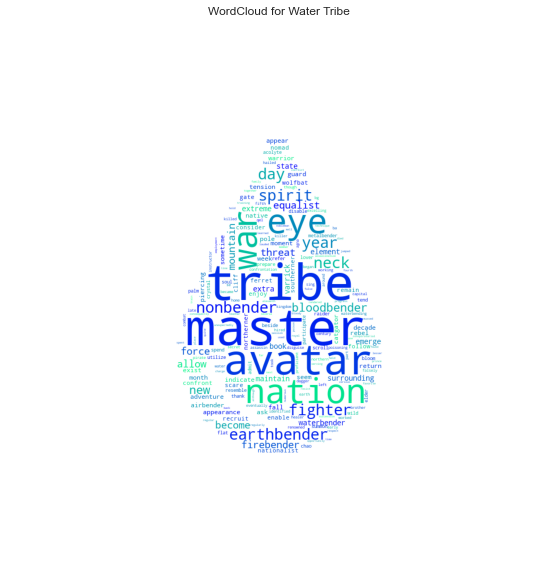
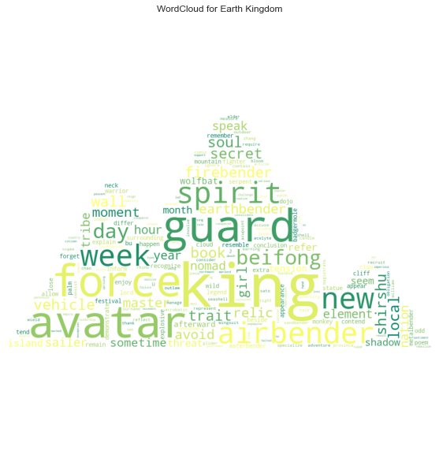
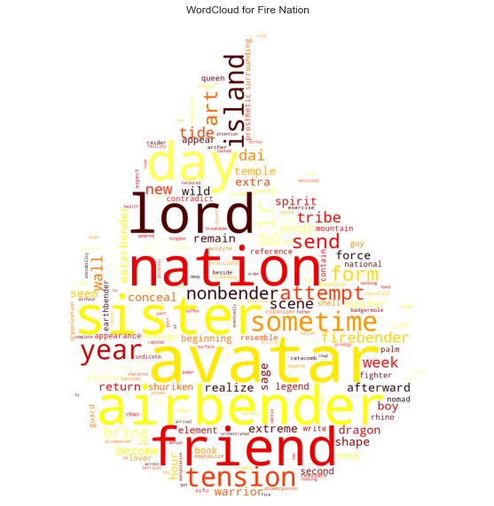
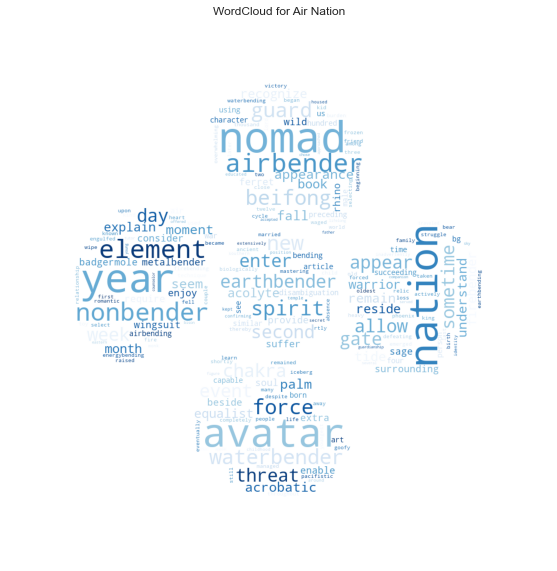
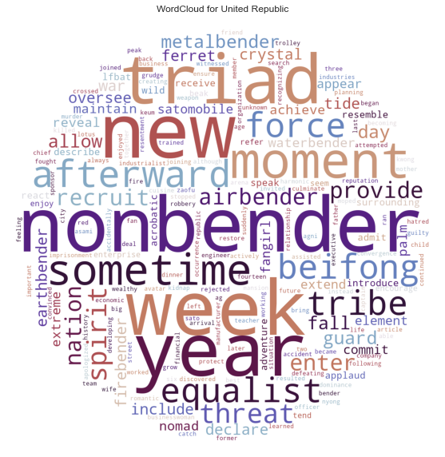
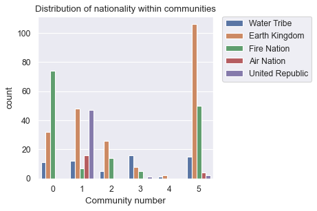
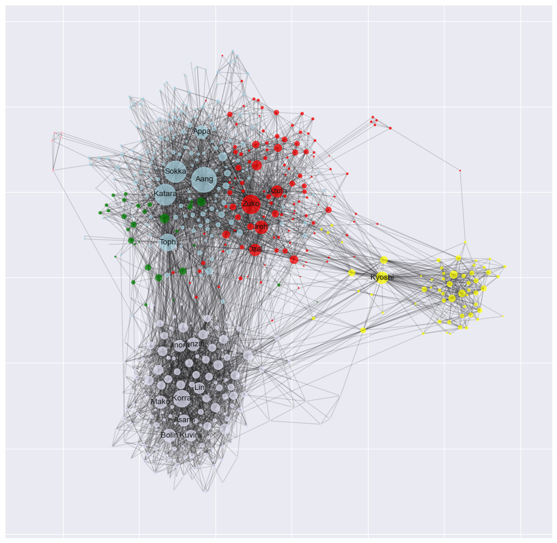
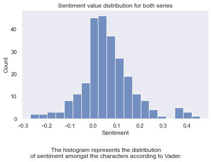

# Introduction

<link rel="stylesheet" href="https://cdn.jsdelivr.net/npm/leaflet@1.6.0/dist/leaflet.css"/>
<!--<link rel="stylesheet" href="https://maxcdn.bootstrapcdn.com/bootstrap/3.2.0/css/bootstrap.min.css"/>-->
<!--<link rel="stylesheet" href="//netdna.bootstrapcdn.com/bootstrap/3.0.0/css/bootstrap-glyphicons.css"/>-->
<link rel="stylesheet" href="https://maxcdn.bootstrapcdn.com/bootstrap/3.2.0/css/bootstrap-theme.min.css"/>
<link rel="stylesheet" href="https://maxcdn.bootstrapcdn.com/font-awesome/4.6.3/css/font-awesome.min.css"/>
<link rel="stylesheet" href="https://cdnjs.cloudflare.com/ajax/libs/Leaflet.awesome-markers/2.0.2/leaflet.awesome-markers.css"/>
<link rel="stylesheet" href="https://cdn.jsdelivr.net/gh/python-visualization/folium/folium/templates/leaflet.awesome.rotate.min.css"/>

*Avatar: The Last Airbender* (ATLA) is a critically acclaimed animation series, by authors *Michael DiMartino* and *Bryan Konietzko*, that first aired in 2005. It split itself over two series, the titular *Avatar: The Last Airbender* and ending with *The Legend of Korra* in 2012.
The first series follows *Aang*, a young boy struggling with the burden of being denoted the *Avatar*, while the notorious *Hundred-year War* rages on by the aggressors, the *Fire Nation*. The final series, *The Legend of Korra*, is set 70 years after the finale of the first series. Nothing but a child, *Korra* is likewise denoted the *Avatar*, and troubles follow.

The series has only grown in popularity since its inception, and we therefore consider this a prime time to take a *deep dive* into the *Avatar: The Last Airbender* universe. We will explore the connections between characters, and characterize their behaviour (both invidually and in groups) by analyzing their spoken word. Differences of mood within and across series will also be analyzed. All this is made possible by the use of the [Avatar fandom wiki](avatar.fandom.com/wiki/Avatar_Wiki), containing all information needed to make our analysis.

# The social network, visualized
Within ATLA, characters have social relations, just like we do in real life. Some characters pave their way and become famous, while others live a humble life and stick to their own. In this section, we want to *visualize* the social network of ATLA. Each *node* of the network represents a character, and each *link* (the lines between nodes) represents a connection between two characters. For our analysis,
connections are formed by inspecting a character's respective fandom wiki page. If a character's page mentions another character, those two receive a link and vice versa.

<!--- network vis here --->

The above image shows the social network of ATLA according to the fandom wiki. There is a lot to take in here, so we'll go through each part one-by-one.  What you may notice first is that some nodes are larger than others. This is due to nodes being sized according to their *degree*, i.e. the number of connections a character has. The largest nodes are also labelled, and we see familiar characters like *Aang*, *Katara*, *Korra* and so on. Nodes are also colored according to the *nationality* of a character. The Fire Nation is red, Air Nation white-ish, Earth Kingdom green, Water Tribe blue, United Republic purple and unknown nationalities are black. What we see is that characters of similar nationalities tend to be *flocked* close together. The same is true for the color of links. If a link connects characters of the same nationality, the link will be that nationality's color. There is a general tendency for characters of the same nationality to be connected, but there are also *many* links for which this does not hold.
It is also interesting that we can see *Aang* and *Korra* in separate clusters. This provides a distinction between which series a character is associated with.

The above visualization gives an overview, but we take additional steps to get the specifics. We wish to examine the number of links each character possesses, called the *degree distribution*.

<!--- degree distribution here --->

The above shows the degree distribution, represented by a histogram to the left and a log-log scatter plot to the right. It is clear that characters in ATLA are not created equal. Links are distributed extremely disproportionately between characters, seen clearly on the histogram. Most characters have a very low number of links, and inversely, very few characters have a very high number of links. We can see this represented on the log-log plot, where the distribution follows a straight line. What we see here is similar to what happens in real social networks. A few key chararcters serve as *hubs* (in this case *Aang*, *Korra* etc.) encompassing a large number of links. Lesser known characters then share connections through these hubs. Networks that possess this property are typically called *scale free networks*.

## What does a character in ATLA look like?
The ATLA universe contains characters of many shapes and sizes. Here, we'll explore the basic characteristics of an entity within the universe.

Above, we see the distrubution of nationality within avatar. We see that the Earth Kingdom is by far the most represented nation, but the Fire Nation following behind in second. It makes sense that the Water Tribe and Air Nation are small, since they are much closer to tribes found in the real world. We cannot actually say that the Earth Kingdom has a larger population than the Fire Nation from the above. What we can say however, is that the main characters of both series interact with characters from the Earth Kingdom to a greater degree. The United Republic, first formed in the second series, receives less attention than either of the major nations.

One of the selling points of ATLA is that characters are able to perform *bending*. Bending is the act of manipulating one of the basic four elements: fire, water, earth and air. Each character is naturally attuned toward a specific element. The key aspect of the *Avatar* is that they are able to manipulate all four elements.

As we can see above, the *vast* majority of characters are non-benders. This gives us an interesting aspect of the series. Mastering a bending art is rare, and most common folk will never master it. It is also expected that this plot is similar to the distribution of nationalities. Characters from the Earth Kingdom are typically earthbenders and so on.

The gender distribution is a bit surprising. It appears that male characters far outweigh the female characters by a factor of more than 2. Determining why this is the case is difficult. In the end, it comes up to how the writers determined to frame the show. The show mainly deals with war and conflict, that is traditionally handled by men. Although, we dare not guess the concrete reason.

## The spoken word of *Avatar: The Last Airbender*
Before expanding on the *dialogue* within the series, now is a good time to explain the episodic structure of ATLA briefly. As mentioned before, ATLA consists of two series: *Avatar: The Last Airbender* and *The Legend of Korra*. Each series consists of several seasons, where an individual season is denoted a *book*.

Here we see the books of each series, and the number of episodes in each. Each book is also named according to an elemental concept, such as *Water* or *Fire*. *Avatar: The Last Airbender* consists of **61** episodes across **3** books. *The Legend of Korra* consists of **52** episodes across **4** books. It is important to note that both series are similar in length, making comparison between the two easier.

Naturally, characters within the show do speak, and therefore have dialogue. Dialogue is used to portray emotions and desires of characters, and that means that it can be *analyzed*. The fandom wiki contains *transcripts* of all episodes mentioned above, allowing us to extract individual lines of dialogue for each character.

The above plot shows the number of *spoken words* in each book.
We find that the results are consistent with the episode counts found previously. It makes sense that a higher episode count results in a higher amount of dialogue *per* book. However, since *Legend of Korra* contains an additional season, we can deduce that it has a higher word count than the first series.

# Depicting nationality through word clouds

We'll dive head first into text analysis by utilizing *word clouds*. Word clouds are blobs of words of differing sizes. The size of a word symbolizes the importance of that word. We wish to use this tool to show the most important words related to each nationality of ATLA.

The Water Tribe is a hunter-gatherer society, based on the inuit tribes of the northern hemisphere. The fact that they are hunters also means that they are capable of fighting. We see this clearly in the word cloud, with a lot of words related to combat: *warrior*, *tribe*, *guard*, *fighter* and so on. There are also references to the bending arts. It is notably that the signature bending style of the Water Tribe, waterbending, is not particularly emphasized. Earthbending appears to claim the spot of most emphasized bending art. The top four words are *tribe*, *avatar*, *nation* and *master*. Unfortunately, these words do not give much insight into the Water Tribe, as they are relatively generic.

The Earth Kingdom, a monarchy, is the largest nation in terms of land mass. It is also economically prosperous, based on extensive agriculture and industry. The Earth Kingdom was extensively targeted in the so-called *Hundred Year War* started by the Fire Nation due to their power. The monarchy is represented in the word cloud by the words *king*, *guard* and *wall*. There are also words directly related to the war, such as *force*, *threat* and *tension*. Generally, it is difficult to extract concrete characteristics from this word cloud. It could be beacuse the Earth Kingdom is so vast with a diverse cast of characters.

The leader of the Fire Nation is deemed the *lord*, explaining why it is so prominent on the word cloud. The word *sister* is most certainly emphasized due to the character *Azula*, the egotistical sister of *Zuko*, another main character of the series. She plays a key role throughout the series, often sabotaging the main characters in various ways. We find it surprising that the Fire Nation word cloud does not contain aggressive and combatant terms to a large degree. We do see words like *force*, *tension* and *firebender*, but these are not overly harsh words. This tells us that perhaps attributing the Fire Nation as warmongers is unfair. We should also recall that our corpus consists of *all* Fire Nation characters. The nation's leaders can still be invasive and imperialistic, while the common folk can be peaceful and kind.

The top word is *nomad*, which precisely is the status of the Air Nation's inhabitants. The Air Nation is known to have a relative large degree of benders (when compared to other nations), explaining why *airbender* is high on the list. Regardless, *nonbender* is still prominent. In terms of spiritual terms, we see *chakra*, *spirit*, *sage* and *cycle*.

The United Republic is special, since it is an amalgamation of the previous four nations. It was created during *The Legend of Korra*, making it a young nation. We feel that the diversity of the republic is represented in the word cloud. There are *a lot* of different terms that are only vaguely related. Many of the words from the previous word clouds are present. The most prominent word is *nonbender*, indicating that the republic contains a large degree of nonbenders. We can also see some of the nation's issues through *gangster*, *triad*, *equalist*, *robbery*, *hatred*, *killed* and *imprisonment*. Equalists are a radical group against benders, while triads are groups of gangsters. We see a focus on business and industry as well with *business*, *industry*, *wealthy*, *economic*, *future* and *enterprise*.

# Communities
Before continuing with text analysis, a quick detour is in order.  In this section, we are interested in exploring the concept of *communities* in the ATLA universe. We've already seen an abstract form of communities via nationalities, that puts each character into a group. *Community detection* is a way of partitioning a network such that each group is densely connected. For example, a community could consist of *Aang*, *Katara*, *Sokka* and *Appa*. These characters accompany each other througout the show, and have many common connections. Community detection follows the same core principles, but works on a much larger and systematic scale.

By examining communities, we can see if characters of the same nationality really do flock together. We can also see how characters across both series are related.

The above shows the distribution of community sizes, along with their internal representation of nationality. We see that our partition contains **6** communities in total. The communities are of varying sizes, with three communities boasting over 100 members. The two smallest communities have less than 30 members each.
The plot somewhat confirm our hypothesis. Almost all communities have a nationality that is overrepresented. The only expection is community **1**, which is also the only community to contain a large number of United Republic members. This is a clear indicator that community **1** encapsulates characters from *The Legend of Korra*.

In order to solidify our findings, we will revisualize our network from earlier. This time however, nodes will be colored according to the community they belong to.

The above visualization is impactful. Based on the labels, we can see that we managed to accurately partition characters between the two series. All the nodes in the grey community are directly associated with *The Legend of Korra*, while the rest have a role in both series (albeit mostly the first).  The light blue community managed to capture the first 5 members of the original *Team Avatar* which the first series focuses on. In the red community, we also see members of the royal Fire Nation family. We also added some additional character labels, and with this, we see *Appa*, the flying bison in the light blue community! It is amusing that a non-human (which cannot even speak) has such a large role in this community.

# Sentiment analysis
In this section, we will perform *sentiment analysis* using the extracted character dialogue. Sentiment analysis is a way to evaluate text as either *positive* or *negative*. For example, the following sentence would be considered positive: "*You are so sweet!*". Contrarily, "*You are a big idiot*" would be considered very negative. We will use this tool to rank characters as positive or negative.

Many Fire Nation characters (such as *Ozai* and *Zuko*) are known for being negative. The Fire Nation in general has a bad reputation. It is also interesting to know the distribution of character sentiment. Are charactrs generally negative or positive? We hope find the truth during the following sections.

The above plot seems to portray something akin to a normal distribution. Although there seems to be a few outliers to the right.
We see most charactrs in the *neutral* range around $0$, with less characters appearing at either end. At the right tail, there is an extraordinary amount of positive characters. It is possible that these are our main characters, who are figuratively shining beams of light. The number of negative characters is not especially high.

The previous plot gave us an overview, but hopefully we can get to the specifics here. At first we will consider the top 10 'happiest' characters. There is a small note here. We only include characters with more than **100** words of dialogue. Characters with less makes the ranking skewed, as even few spoken words can have dramatic consequences.

<table border="0" class="big-center">
  <thead>
    <tr style="text-align: center;">
      <th></th>
      <th>Nationality</th>
      <th>Gender</th>
      <th>Word count</th>
      <th>Sentiment</th>
    </tr>
  </thead>
  <tbody>
    <tr>
      <th>Ty Lee</th>
      <td>Fire Nation</td>
      <td>Female</td>
      <td>299</td>
      <td>0.207650</td>
    </tr>
    <tr>
      <th>Zei</th>
      <td>Earth Kingdom</td>
      <td>Male</td>
      <td>203</td>
      <td>0.176929</td>
    </tr>
    <tr>
      <th>Pakku</th>
      <td>Water Tribe</td>
      <td>Male</td>
      <td>226</td>
      <td>0.167621</td>
    </tr>
    <tr>
      <th>Yin</th>
      <td>Earth Kingdom</td>
      <td>Female</td>
      <td>153</td>
      <td>0.161825</td>
    </tr>
    <tr>
      <th>Sozin</th>
      <td>Fire Nation</td>
      <td>Male</td>
      <td>212</td>
      <td>0.157504</td>
    </tr>
    <tr>
      <th>Gun</th>
      <td>Earth Kingdom</td>
      <td>Male</td>
      <td>169</td>
      <td>0.147874</td>
    </tr>
    <tr>
      <th>Hiroshi</th>
      <td>Earth Kingdom</td>
      <td>Male</td>
      <td>115</td>
      <td>0.146563</td>
    </tr>
    <tr>
      <th>Teo</th>
      <td>Earth Kingdom</td>
      <td>Male</td>
      <td>174</td>
      <td>0.135319</td>
    </tr>
    <tr>
      <th>Vaatu</th>
      <td>NaN</td>
      <td>Male</td>
      <td>160</td>
      <td>0.127987</td>
    </tr>
    <tr>
      <th>Jet</th>
      <td>Earth Kingdom</td>
      <td>Male</td>
      <td>203</td>
      <td>0.117753</td>
    </tr>
  </tbody>
</table>

The above table shows the 10 most positive characters.
The most positive character, by a far margin, is *Ty Lee*. She is a young girl from the Fire Nation. The fandom wiki describes her as "*[...] bubbly and outgoing [...]*", which matches her sentiment value. Generally, her page describes her as affectionate and kind.

There are also a few surprises here. *Vaatu* is the "*the spirit of darkness and chaos*" according the wiki. He is the main antagonist during *The Legend of Korra*, and can not exactly be described as a positive character. He even has dialogue where he speaks of annihilating other characters. However, we must he remember that he has little dialogue, only at 160 words. In some of this dialogue, he tricks another character, by appearing benevolent and kind, into freeing him from his prison. This could help explain why he is so high up.

*Sozin* is another case of confusion. He singlehandedly eradicated a large fraction of Air Nomads (not yet part of the Air Nation) in an attempt to gain power. He is also the person responsible for initiating the *Hundred-year war*, the main plot point of the first series. In short, he wishes the Fire Nation to reign supreme. We had to carefully examine his dialogue to account for this. It appears that he is only directly involved in very few scenes, where he is depicted in his (more positive) younger years. It is only other characters who speak of his atrocities.

We also find *none* of the main cast present in the top 10. This denies our hypothesis previously presented that the outliers could be main characters.

<table border="0" class="big-center">
  <thead>
    <tr style="text-align: center;">
      <th></th>
      <th>Nationality</th>
      <th>Gender</th>
      <th>Word count</th>
      <th>Sentiment</th>
    </tr>
  </thead>
  <tbody>
    <tr>
      <th>Gan Jin leader</th>
      <td>Earth Kingdom</td>
      <td>Male</td>
      <td>143</td>
      <td>-0.083761</td>
    </tr>
    <tr>
      <th>Zhang leader</th>
      <td>Earth Kingdom</td>
      <td>Female</td>
      <td>190</td>
      <td>-0.063002</td>
    </tr>
    <tr>
      <th>Raava</th>
      <td>NaN</td>
      <td>Female</td>
      <td>241</td>
      <td>-0.054711</td>
    </tr>
    <tr>
      <th>Mechanist</th>
      <td>Earth Kingdom</td>
      <td>Male</td>
      <td>358</td>
      <td>-0.042000</td>
    </tr>
    <tr>
      <th>Wan Shi Tong</th>
      <td>NaN</td>
      <td>Male</td>
      <td>210</td>
      <td>-0.028506</td>
    </tr>
    <tr>
      <th>Canyon guide</th>
      <td>Earth Kingdom</td>
      <td>Male</td>
      <td>115</td>
      <td>-0.024218</td>
    </tr>
    <tr>
      <th>Jeong Jeong</th>
      <td>Fire Nation</td>
      <td>Male</td>
      <td>244</td>
      <td>-0.016247</td>
    </tr>
    <tr>
      <th>Shyu</th>
      <td>Fire Nation</td>
      <td>Male</td>
      <td>150</td>
      <td>-0.015422</td>
    </tr>
    <tr>
      <th>Xin Fu</th>
      <td>Earth Kingdom</td>
      <td>Male</td>
      <td>119</td>
      <td>-0.012476</td>
    </tr>
    <tr>
      <th>Mai</th>
      <td>Fire Nation</td>
      <td>Female</td>
      <td>352</td>
      <td>-0.012045</td>
    </tr>
  </tbody>
</table>

*Raava* is the direct contrast to *Vaatu*. She is the spirit of light and peace, and one might find it equally surprising to find her present on the bottom 10. However, simply being the proctector of peace does not make her a positive character per default. The wiki describes her as abrasive and intolerant of people with differing beliefs. Therefore, we actually find this assessment to be accurate.

The rest of the list is not surprising. These are all characters that either have negative personalities, or have suffered deep personal losses. Nonetheless, most of these characters are from the first series, denoting a difference between the two.

# Temporal sentiment analysis
# Afterword

what a ride its been....

# More details

## Download
To download the scraped data from the fandom wiki, one can use this [link](https://drive.google.com/drive/folders/1clkgTPeM7uLm30IFX5zSLVsI_2E0MgXT?usp=sharing).

The google drive folder consists of three files:
- `episode_info_df.csv`: contains episode names, episode numbers, season numbers etc. for all episodes of both series.
- `avatar_data.csv`: contains the names of every character used and their nationality.
- `atla_lok_transcript.csv`: contains attributed dialogue for all characters.

The datasets are small and relatively easy to work with, so feel free to explore on your own.

## Explainer notebook
The more technically inclined readers can take a look at our *explainer notebook*. This notebook contains all the nitty-gritty details required for making this website, right from data scraping to full-on sentiment analysis. The notebook can be viewed in your browser using [nbviewer](https://nbviewer.org/github/philipwastakenwastaken/social-graphs-project-2021/blob/main/explainer.ipynb).

You can also view and download it from [Github](https://github.com/philipwastakenwastaken/social-graphs-project-2021). Note that running
the notebook yourself will take **several hours**, so only do so if you have patience.

# References

- Luca, Michael (2016). "Reviews, Reputation, and Revenue: The Case of Yelp.com". In: *Harvard Business School NOM Unit Working Paper No. 12-016*. Available at SSRN: https://ssrn.com/abstract=1928601 or http://dx.doi.org/10.2139/ssrn.1928601.
- Anderson, M.L., and J. Magruder (2013). "Does Yelp Affect Restaurant Demand?" In: *ARE Update 16(5):1-4*. University of California Giannini Foundation of Agricultural Economics.
- Loten, Angus (2014). "Yelp Regularly Gets Subpoenas About Users". In: *The Wall Street Journal*.
- Yelp (2021). "Yelp Open Dataset". Retrieved from: https://www.yelp.com/dataset at 08/05/2021.
- Lin, Carol and Ji, Matt (2014). "Austin Neighbourhoods". Retrieved from https://www.austintexasinsider.com/austinneighborhoods.html at 09/05/2021.
