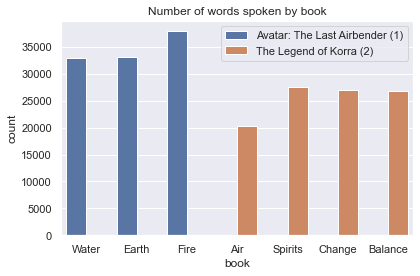

# Introduction

<link rel="stylesheet" href="https://cdn.jsdelivr.net/npm/leaflet@1.6.0/dist/leaflet.css"/>
<!--<link rel="stylesheet" href="https://maxcdn.bootstrapcdn.com/bootstrap/3.2.0/css/bootstrap.min.css"/>-->
<!--<link rel="stylesheet" href="//netdna.bootstrapcdn.com/bootstrap/3.0.0/css/bootstrap-glyphicons.css"/>-->
<link rel="stylesheet" href="https://maxcdn.bootstrapcdn.com/bootstrap/3.2.0/css/bootstrap-theme.min.css"/>
<link rel="stylesheet" href="https://maxcdn.bootstrapcdn.com/font-awesome/4.6.3/css/font-awesome.min.css"/>
<link rel="stylesheet" href="https://cdnjs.cloudflare.com/ajax/libs/Leaflet.awesome-markers/2.0.2/leaflet.awesome-markers.css"/>
<link rel="stylesheet" href="https://cdn.jsdelivr.net/gh/python-visualization/folium/folium/templates/leaflet.awesome.rotate.min.css"/>

*Avatar: The Last Airbender* (ATLA) is a critically acclaimed animation series, by authors *Michael DiMartino* and *Bryan Konietzko*, that first aired in 2005. It split itself over two series, the titular *Avatar: The Last Airbender* and ending with *The Legend of Korra* in 2012.
The first series follows *Aang*, a young boy struggling with the burden of being denoted the *Avatar*, while the notorious *Hundred-year War* rages on by the aggressors, the *Fire Nation*. The final series, *The Legend of Korra*, is set 70 years after the finale of the first series. Nothing but a child, *Korra* is likewise denoted the *Avatar*, and troubles follow.

The series has only grown in popularity since its inception, and we therefore consider this a prime time to take a *deep dive* into the *Avatar: The Last Airbender* universe. We will explore the connections between characters, and characterize their behaviour (both invidually and in groups) by analyzing their spoken word. Differences of mood within and across series will also be analyzed. All this is made possible by the use of the [Avatar fandom wiki](avatar.fandom.com/wiki/Avatar_Wiki), containing all information needed to make our analysis.

# The social network, visualized
Within ATLA, characters have social relations, just like we do in real life. Some characters pave their way and become famous, while others live a humble life and stick to their own. In this section, we want to *visualize* the social network of ATLA. Each *node* of the network represents a character, and each *link* (the lines between nodes) represents a connection between two characters. For our analysis,
connections are formed by inspecting a character's respective fandom wiki page. If a character's page mentions another character, those two receive a link and vice versa.

<!--- network vis here --->

The above image shows the social network of ATLA according to the fandom wiki. There is a lot to take in here, so we'll go through each part one-by-one.  What you may notice first is that some nodes are larger than others. This is due to nodes being sized according to their *degree*, i.e. the number of connections a character has. The largest nodes are also labelled, and we see familiar characters like *Aang*, *Katara*, *Korra* and so on. Nodes are also colored according to the *nationality* of a character. The Fire Nation is red, Air Nation white-ish, Earth Kingdom green, Water Tribe blue, United Republic purple and unknown nationalities are black. What we see is that characters of similar nationalities tend to be *flocked* close together. The same is true for the color of links. If a link connects characters of the same nationality, the link will be that nationality's color. There is a general tendency for characters of the same nationality to be connected, but there are also *many* links for which this does not hold.
It is also interesting that we can see *Aang* and *Korra* in separate clusters. This provides a distinction between which series a character is associated with.

The above visualization gives an overview, but we take additional steps to get the specifics. We wish to examine the number of links each character possesses, called the *degree distribution*.

<!--- degree distribution here --->

The above shows the degree distribution, represented by a histogram to the left and a log-log scatter plot to the right. It is clear that characters in ATLA are not created equal. Links are distributed extremely disproportionately between characters, seen clearly on the histogram. Most characters have a very low number of links, and inversely, very few characters have a very high number of links. We can see this represented on the log-log plot, where the distribution follows a straight line. What we see here is similar to what happens in real social networks. A few key chararcters serve as *hubs* (in this case *Aang*, *Korra* etc.) encompassing a large number of links. Lesser known characters then share connections through these hubs. Networks that possess this property are typically called *scale free networks*.

## What does a character in ATLA look like?
The ATLA universe contains characters of many shapes and sizes. Here, we'll explore the basic characteristics of an entity within the universe.

Above, we see the distrubution of nationality within avatar. We see that the Earth Kingdom is by far the most represented nation, but the Fire Nation following behind in second. It makes sense that the Water Tribe and Air Nation are small, since they are much closer to tribes found in the real world. We cannot actually say that the Earth Kingdom has a larger population than the Fire Nation from the above. What we can say however, is that the main characters of both series interact with characters from the Earth Kingdom to a greater degree. The United Republic, first formed in the second series, receives less attention than either of the major nations.

One of the selling points of ATLA is that characters are able to perform *bending*. Bending is the act of manipulating one of the basic four elements: fire, water, earth and air. Each character is naturally attuned toward a specific element. The key aspect of the *Avatar* is that they are able to manipulate all four elements.

As we can see above, the *vast* majority of characters are non-benders. This gives us an interesting aspect of the series. Mastering a bending art is rare, and most common folk will never master it. It is also expected that this plot is similar to the distribution of nationalities. Characters from the Earth Kingdom are typically earthbenders and so on.

The gender distribution is a bit surprising. It appears that male characters far outweigh the female characters by a factor of more than 2. Determining why this is the case is difficult. In the end, it comes up to how the writers determined to frame the show. The show mainly deals with war and conflict, that is traditionally handled by men. Although, we dare not guess the concrete reason.

## The spoken word of *Avatar: The Last Airbender*
Before expanding on the *dialogue* within the series, now is a good time to explain the episodic structure of ATLA briefly. As mentioned before, ATLA consists of two series: *Avatar: The Last Airbender* and *The Legend of Korra*. Each series consists of several seasons, where an individual season is denoted a *book*.

Here we see the books of each series, and the number of episodes in each. Each book is also named according to an elemental concept, such as *Water* or *Fire*. *Avatar: The Last Airbender* consists of **61** episodes across **3** books. *The Legend of Korra* consists of **52** episodes across **4** books. It is important to note that both series are similar in length, making comparison between the two easier.

Naturally, characters within the show do speak, and therefore have dialogue. Dialogue is used to portray emotions and desires of characters, and that means that it can be *analyzed*. The fandom wiki contains *transcripts* of all episodes mentioned above, allowing us to extract individual lines of dialogue for each character.

The above plot shows the number of *spoken words* in each book.

# Community detection
In order to easier visualize the dataset, we narrow our focus to Austin, Texas. Austin is a city located in the United States within the state of Texas, serving as the state capital city. With a population of 978,908, it is the 11th largest city in the US
by population count. The city is therefore populous enough to be representative of the *Yelp* dataset. Austin also encompasses more than 100 neighbourhoods, making it ideal for map-style visualizations.



The above map shows the most central neighbourhoods in Austin, and the amount of businesses each neighbourhood has with at least one *Yelp* review. Neighbourhoods are colour-coded, where purple contains the least amount of businesses, and yellow contains the most. **Hover** over each neighbourhood to see the exact amount of businesses it contains. Most neighbourhoods are in the same range, with the only clear outlier being downtown Austin with 2026 businesses.

## Nationality and speech

<!--- show word clouds here --->
As we have already mentioned, Austin is compartmentalized into several neighbourhoods. We will now explore the significance of location as a business owner in Austin.

The map below shows the colour-coded (defined by the chart to the right) review average for a given neighbourhood. **Hover** over a neighbourhood to see name, number of reviews and review average.
We see *clear* groupings when considering the review average. Central, South, West, Southwest and Northwest are generally considered to be the *desired* parts of Austin (Lin and Ji 2014). These are high income areas
with low crime rates, and are typically not ethnically diverse. These parts of Austin enjoy a high review average - most neighbourhoods have an average in the $$3.8$$-$$4.3$$ range.

# Final Words
As stated, *Yelp* has a negative reputation. However, by examining the *Yelp* dataset, some interesting elements could be found about the culture of *Yelp*, its impact and some elements potential business owners should have in mind. Reviews are getting more positive, though also more polarized. However, it is quite clear that social inequalities are reflected in the user reviews, which adds to the negative aspects of *Yelp*. We also saw how attributes affect the rating how a business, much to the dismay of dog owners. Either way, *Yelp* has, by the looks of it, come to stay. But business-owners-to-be might need to consider more than e.g. just the quality of their food, as other variables seem to impact reviews. Furthermore, reviewers of *Yelp* (which might include you), need to consider the impact of reviews and be fair.

# More Details

## Download
To download the scraped data from the fandom wiki, one can you this [link](https://drive.google.com/drive/folders/1clkgTPeM7uLm30IFX5zSLVsI_2E0MgXT?usp=sharing).

The google drive folder consists of three files:
- `episode_info_df.csv`: contains episode names, episode numbers, season numbers etc. for all episodes of both series.
- `avatar_data.csv`: contains the names of every character used and their nationality.
- `atla_lok_transcript.csv`: contains attributed dialogue for all characters.

The datasets are small and relatively easy to work with, so feel free to explore on your own.

## Explainer notebook
The more technically inclined readers can take a look at our *explainer notebook*. This notebook contains all the nitty-gritty details required for making this website, right from data scraping to full-on sentiment analysis. The notebook can be viewed in your browser using [nbviewer](https://nbviewer.org/github/philipwastakenwastaken/social-graphs-project-2021/blob/main/explainer.ipynb).

You can also view and download it from [Github](https://github.com/philipwastakenwastaken/social-graphs-project-2021). Note that running
the notebook yourself will take **several hours**, so only do so if you have patience.

# References

- Luca, Michael (2016). "Reviews, Reputation, and Revenue: The Case of Yelp.com". In: *Harvard Business School NOM Unit Working Paper No. 12-016*. Available at SSRN: https://ssrn.com/abstract=1928601 or http://dx.doi.org/10.2139/ssrn.1928601.
- Anderson, M.L., and J. Magruder (2013). "Does Yelp Affect Restaurant Demand?" In: *ARE Update 16(5):1-4*. University of California Giannini Foundation of Agricultural Economics.
- Loten, Angus (2014). "Yelp Regularly Gets Subpoenas About Users". In: *The Wall Street Journal*.
- Yelp (2021). "Yelp Open Dataset". Retrieved from: https://www.yelp.com/dataset at 08/05/2021.
- Lin, Carol and Ji, Matt (2014). "Austin Neighbourhoods". Retrieved from https://www.austintexasinsider.com/austinneighborhoods.html at 09/05/2021.
